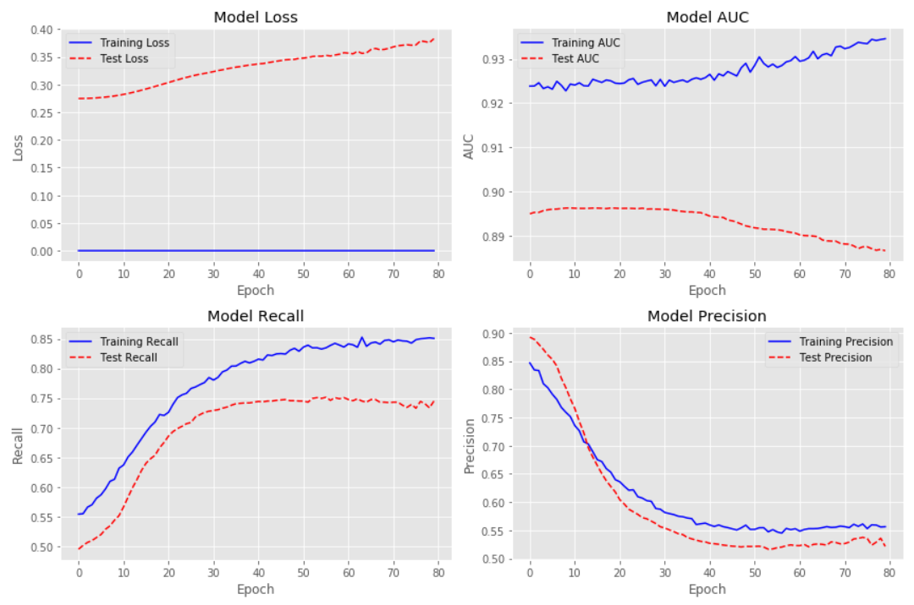
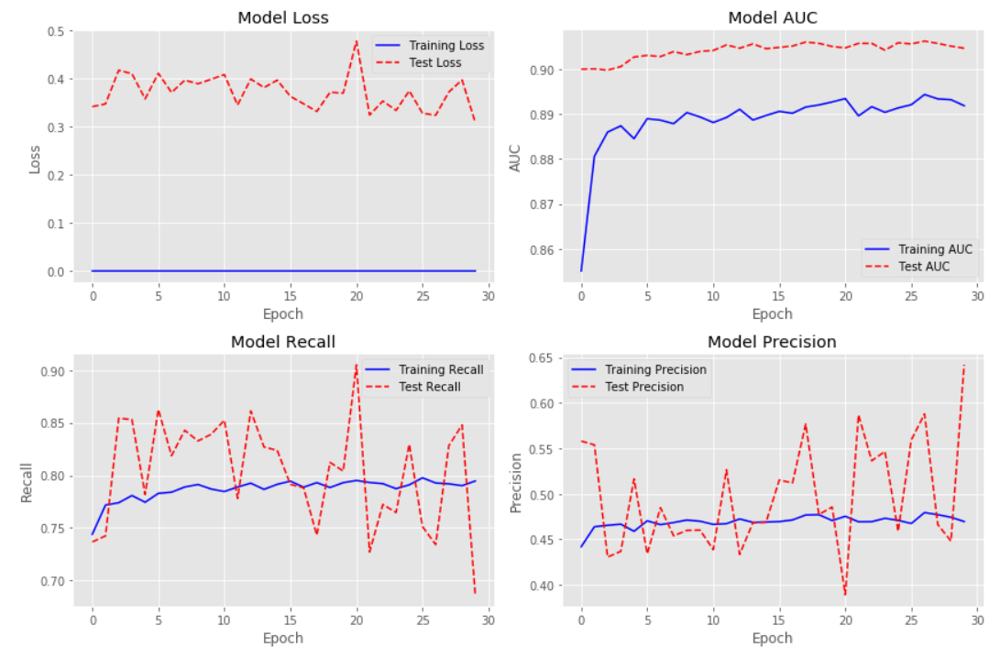
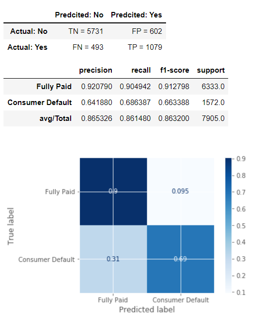
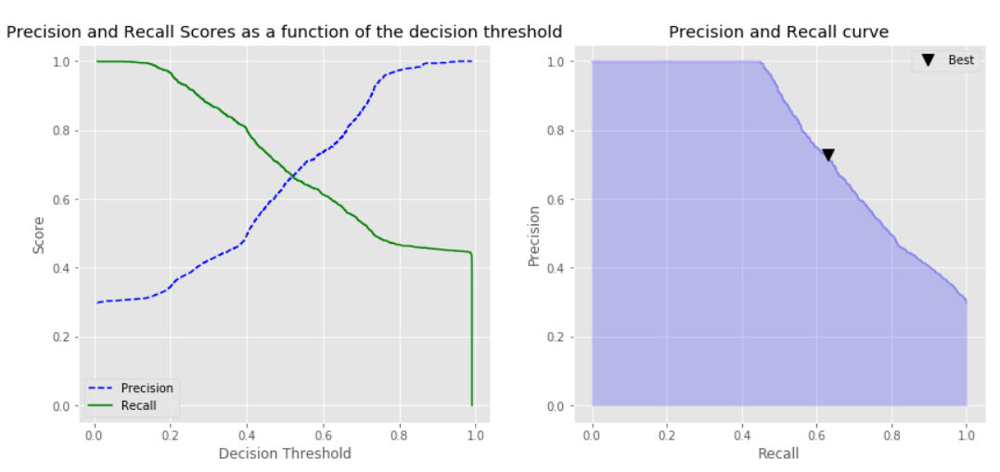
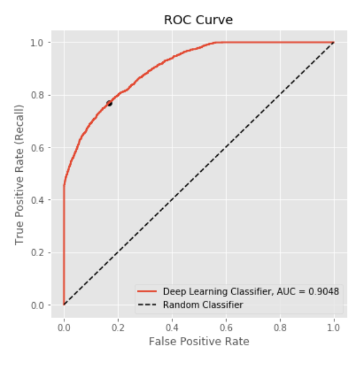
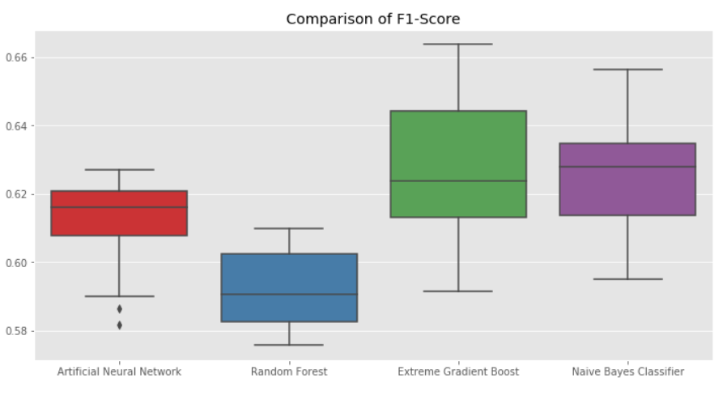

# Artificial Neural Network for Customer Classification
Here Artificial Neural Network (ANN) is utilized to predict whether or not an applicant will be able to repay a loan. The influence of adding Dropout layer, adding Class Weight and different Activation Kernels investigated on the model performance. Performances of ANN network was investigated using multiple accuracy metrics including precision, recall and ROC curves. A grid search was used to optimize activation kernel and also hyper parameters including dropout rate and weight constrain.

The historical loan application data from Lending Club Loans are used to train the ANN. Exploratory Analysis of above dataset to identify correlation between feature variables followed by handling missing data and categorical variables are explained in my previous project titled [Comprehensive Evaluation of Machine Learning Techniques to Predict Customer Default](https://github.com/majid-hosseini/Machine-Learning-Techniques-to-Predict-Customer-Default).

The final processed data file is used here and a copy of it is copied in dataset folder of this project.

## Project background and objectives
A sequential model with multiple layers and relu activation kernel was defined and trained on the data. Some helper functions were developed for plotting purpose and model performance evaluations. 

The comparison of test vs training curves indicated a clear overfitting behavior. Adding dropout layer substantially reduced the overfitting behavior of the model. Then, a class weight is added to deal with the imbalance dataset and compensate for the lower presence of the class_1 (Defaulted customers).

Following is a sample plot of loss, AUC, precision, recall of training vs. test. 

**and after adjusting the Activation Kernel:**

Following are a sample of the examined accuracy metrics:

Obviously, there will be some error associated with every model results in False Positives and False Negatives due to the model classifying things incorrectly as compared to the actual class. There might be the cases where we might want to minimize either False Positives or False negatives depends on the business needs and the context of the problem. Modifying the decision threshold of the model is basically tradeoff between sensitivity and specificity. Functions were developed to find the optimized threshold according to precision_recall_curve and roc_curve and visualized accordingly.

Following plot identifies the optimal threshold based on precision-recall curve:

and identifying the optimal threshold based on ROC curve:

A Grid search was used to automate the process of identifying optimized activation kernel and also hyper parameters including dropout rate and weight constrain. The very same structure can be used to optimized other parameters of the model including choice of optimizers and learning rate.

Finally, performance of current ANN with investigated classifiers in previous project are compared in terms of F1-score and presented in a box plot format.

Please find complete discerption of previous project from the following link:

[Comprehensive Evaluation of Machine Learning Techniques to Predict Customer Default](https://github.com/majid-hosseini/Machine-Learning-Techniques-to-Predict-Customer-Default)

## Project Structure and Sections

This project is an implementation of Artificial Neural Network (ANN) as classifiers and fine tuning of parameters and optimizing of the classification threshold. Following is the project structure and list of sections:

* Section 1: Loading the data
* Section 2: Train Test Split and Normalizing Data
* Section 3: A Review of Accuracy Metrics
* Section 4: Creating the Model
* Section 5: Evaluating Model Performance
* Section 6: Adding Dropout
* Section 7: Adding Class Weight
* Section 8: Influence of Activation Kernel
* Section 9: Model Optimization
* Section 10: Comparison with Previously Investigated Classifier

# Quick start
**unzip the "modified_lending_club_dataset.zip" file located in folder "dataset". Make sure the file "modified_lending_club_dataset.csv" is accessible by Jupiter notebook as "dataset\modified_lending_club_dataset.csv"**

## Dependencies
* Pandas
* Numpy

How to use?
===========
The project is developed in Jupyter Notebooks which is automatically rendered by GitHub. The developed codes and functions for each step are explained in the notebook.

